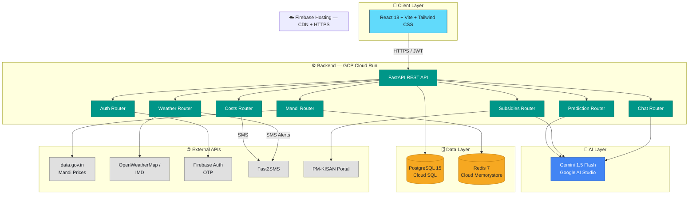
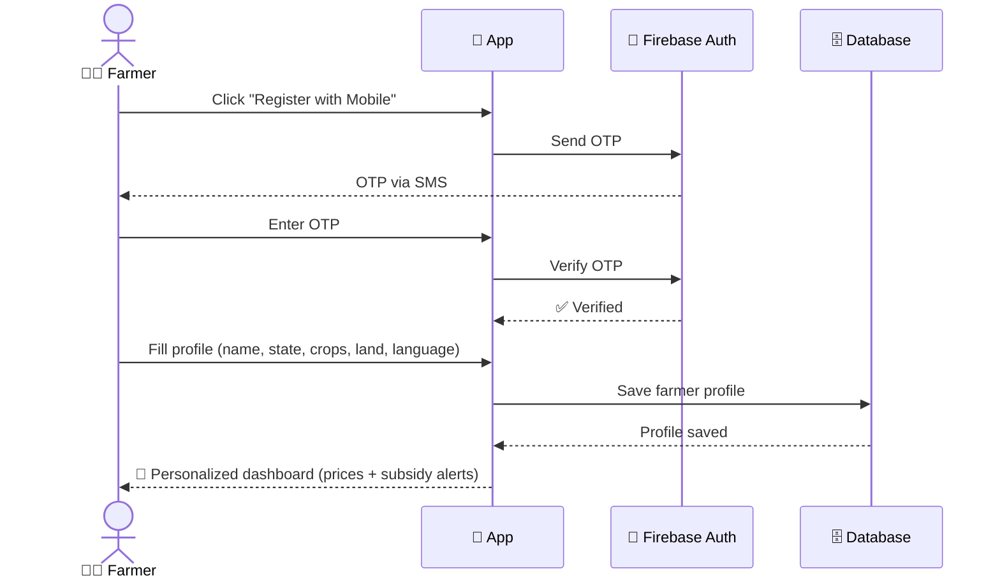
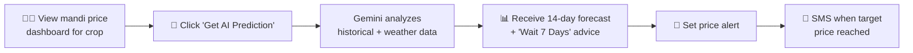
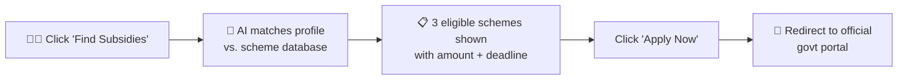
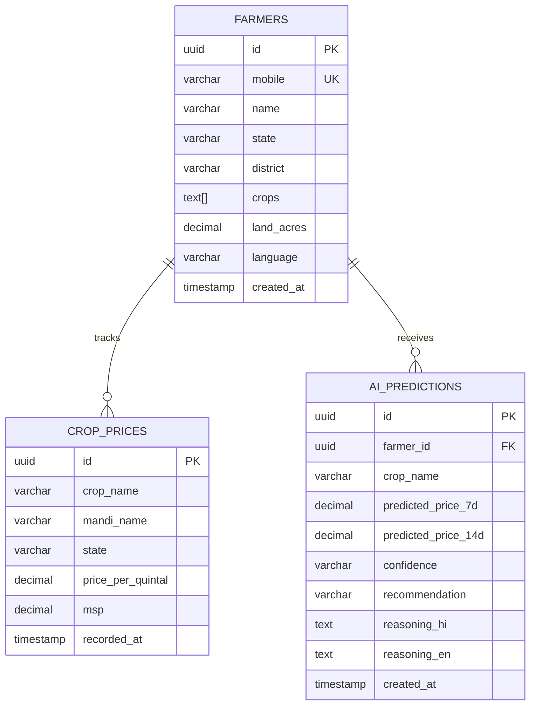
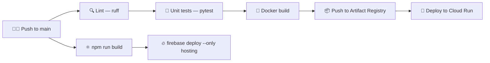

<div align="center">

# 🌾 Kisan Alert

### *AI-Powered Farmer Intelligence Platform*

**Empowering Indian farmers with real-time mandi prices, AI price predictions, subsidy discovery, and weather-risk alerts — in Hindi & English.**

[](#)
[](#)
[](#-license)
[](#)
[](#)
[](#)

<br>

🇮🇳 **Team Apex Innovators** &nbsp;|&nbsp; 📍 Hack2Skill Hackathon &nbsp;|&nbsp; 🗓️ June 2026

</div>

---

## 📖 Table of Contents

- [🎯 About the Project](#-about-the-project)
- [✨ Key Features](#-key-features)
- [🏗️ System Architecture](#️-system-architecture)
- [🔄 User Flows](#-user-flows)
- [🛠️ Tech Stack](#️-tech-stack)
- [📁 Project Structure](#-project-structure)
- [🔌 API Reference](#-api-reference)
- [🗄️ Database Schema](#️-database-schema)
- [🤖 AI Integration](#-ai-integration)
- [☁️ Infrastructure & Deployment](#️-infrastructure--deployment)
- [🔐 Security](#-security)
- [🧪 Testing Strategy](#-testing-strategy)
- [🚀 Getting Started](#-getting-started)
- [🗺️ Roadmap](#️-roadmap)
- [👥 Team](#-team)

---

## 🎯 About the Project

> Small and marginal farmers across India often lack access to **real-time market intelligence** and **government scheme information** — leading to lost income and missed benefits.

**Kisan Alert** solves this with a mobile-first, bilingual (Hindi + English) platform that gives farmers:

| 💰 Better prices | 📋 More subsidies | 🌦️ Fewer crop losses |
|:---:|:---:|:---:|
| AI-predicted mandi prices with sell/wait recommendations | Auto-matched government schemes with direct apply links | Weather-risk alerts mapped to crop-specific advisories |

<details>
<summary><b>📌 Definitions & Glossary</b> (click to expand)</summary>
<br>

| Term | Meaning |
|---|---|
| **Mandi** | Government-regulated wholesale agricultural market in India |
| **PM-KISAN** | Pradhan Mantri Kisan Samman Nidhi — direct income support scheme |
| **MSP** | Minimum Support Price — government-guaranteed minimum crop price |
| **Kharif / Rabi** | Kharif = monsoon crops (Jun–Nov); Rabi = winter crops (Nov–Apr) |
| **IMD** | India Meteorological Department — official weather data source |

</details>

---

## ✨ Key Features

<table>
<tr>
<td width="50%" valign="top">

### 🔐 Registration & Auth
- 📱 OTP-based login via Firebase Auth
- 🧑‍🌾 Profile setup: name, state, district, crops, land size
- 🌐 Language preference (Hindi / English)
- 👨‍👩‍👧 FPO Admin sub-accounts for member farmers
- 🔑 JWT sessions with 30-day refresh

### 📊 Mandi Price Dashboard
- 📈 Real-time prices from `data.gov.in`
- 📉 7 / 30 / 90-day trend charts (Recharts)
- 🏘️ Compare top 5 nearby mandis
- ⚠️ MSP warning banner if price falls below MSP
- ⏱️ Auto-refresh every 6 hours

### 🔮 AI Price Prediction Engine
- 🤖 Gemini 1.5 Flash powered 7 / 14 / 30-day forecasts
- 🎯 Confidence levels: High / Medium / Low
- 💡 "Sell Now" / "Wait 7 Days" / "Wait 14 Days" advice
- 🗣️ Bilingual AI reasoning
- 📚 Prediction accuracy history

</td>
<td width="50%" valign="top">

### 🏛️ Government Subsidy Finder
- 🔍 AI-matched schemes based on farmer profile
- 💵 Benefit amount, eligibility, deadlines
- 🔗 Direct apply links to official portals
- 🔔 SMS/push alerts before deadlines
- 🔄 Monthly-refreshed scheme database

### 🌦️ Weather & Crop Risk Alerts
- ☁️ IMD 7-day district-level forecast
- 🚨 AI-mapped risk: frost, flood, drought, hailstorm
- 🟥🟨🟩 Severity levels with recommended actions
- 📲 SMS alerts for high-severity events

### 💸 Input Cost Optimizer
- 🧾 Log seeds, fertilizer, pesticide, labor, irrigation
- 📊 Category-wise cost breakdown per acre
- ⚖️ AI comparison vs. regional averages
- 📄 Exportable PDF reports for bank loans

### 💬 Multilingual AI Chatbot
- 🗨️ Gemini-powered farmer Q&A, floating widget
- 🎙️ Voice input (Web Speech API)
- 🌱 Domain-trained: crop care, pests, soil, schemes

</td>
</tr>
</table>

---

## 🏗️ System Architecture



### ⏰ Background Task Scheduler (APScheduler)

| Task | Schedule | Action |
|---|:---:|---|
| 🔄 `fetch_mandi_prices` | Every 6 hours | Pull latest prices → update Redis + DB |
| ⛅ `check_weather_alerts` | Every 3 hours | Fetch IMD forecast → compute risk → SMS for High alerts |
| 🔮 `run_price_predictions` | Daily 6:00 AM IST | Batch Gemini prediction for all crop-district combos |
| 🏛️ `refresh_scheme_database` | Monthly | Update govt scheme eligibility data |

---

## 🔄 User Flows

<details open>
<summary><b>1️⃣ New Farmer Onboarding</b></summary>



</details>

<details>
<summary><b>2️⃣ Sell Decision Flow</b></summary>



</details>

<details>
<summary><b>3️⃣ Subsidy Discovery Flow</b></summary>



</details>

---

## 🛠️ Tech Stack

<div align="center">

### Frontend


### Backend


### AI & Cloud


</div>

| Layer | Technology | Purpose |
|---|---|---|
| 🎨 Frontend | React 18 + Vite + Tailwind CSS | Mobile-first farmer dashboard UI |
| ⚙️ Backend API | FastAPI (Python 3.11) | REST API, business logic, data orchestration |
| 🤖 AI Layer | Gemini 1.5 Flash (Google AI Studio) | Price prediction, subsidy matching, chatbot |
| 🗄️ Database | PostgreSQL 15 (Cloud SQL) | Farmer profiles, price history, scheme data |
| ⚡ Cache | Redis 7 (Cloud Memorystore) | Mandi prices, rate limiting, sessions |
| 🔑 Auth | Firebase Authentication | OTP-based mobile login |
| ☁️ Hosting | Cloud Run + Firebase Hosting | Auto-scaling serverless deployment |
| 📲 SMS | Fast2SMS API | Weather alerts and price notifications |

---

## 📁 Project Structure

<table>
<tr>
<td width="50%" valign="top">

**Frontend — `src/`**
```
src/
├── components/     # PriceCard, AlertBanner,
│                   # ChatBot, SubsidyCard
├── pages/          # Dashboard, MandiPrices,
│                   # Subsidies, WeatherAlerts,
│                   # CostTracker
├── hooks/          # useMandiPrices,
│                   # useAIPrediction,
│                   # useSubsidies, useWeather
├── store/          # userStore, languageStore
├── api/            # Axios instance + typed calls
├── locales/        # hi.json, en.json
└── utils/          # formatPrice(), formatDate(),
                     # riskColorMap()
```

</td>
<td width="50%" valign="top">

**Backend — `app/`**
```
app/
├── main.py         # App init, CORS, routers
├── routers/        # mandi, prediction, subsidies,
│                   # weather, costs, auth, chat
├── services/       # MandiService, GeminiService,
│                   # WeatherService, SubsidyService,
│                   # SMSService
├── models/         # SQLAlchemy ORM models
├── schemas/        # Pydantic schemas
├── core/           # config, security (JWT), database
└── tasks/          # price_fetcher, weather_checker,
                     # sms_dispatcher
```

</td>
</tr>
</table>

### 🧭 Frontend Routes

| Route | Component |
|---|---|
| `/` | Landing page with login CTA |
| `/login` | OTP login flow |
| `/dashboard` | Main farmer dashboard |
| `/mandi` | Full mandi price table + AI prediction panel |
| `/subsidies` | Subsidy finder results + scheme cards |
| `/weather` | Weather forecast + crop risk alerts |
| `/costs` | Input cost tracker + profit calculator |
| `/chat` | Full-page AI chatbot (Hindi/English) |

---

## 🔌 API Reference

| Method | Endpoint | Auth | Description |
|:---:|---|:---:|---|
| `POST` | `/auth/send-otp` | 🌐 Public | Send OTP to farmer mobile number |
| `POST` | `/auth/verify-otp` | 🌐 Public | Verify OTP, return JWT token |
| `GET` | `/mandi/prices` | 🔒 JWT | Current prices for farmer's crops + nearby mandis |
| `GET` | `/mandi/history/{crop}` | 🔒 JWT | Historical price data (30/90 day) |
| `POST` | `/predict/price` | 🔒 JWT | Trigger Gemini AI price prediction |
| `GET` | `/subsidies/eligible` | 🔒 JWT | AI-matched subsidies for farmer profile |
| `GET` | `/weather/alerts` | 🔒 JWT | District forecast + crop risk alerts |
| `POST` | `/costs/entry` | 🔒 JWT | Log a new crop input cost entry |
| `GET` | `/costs/summary` | 🔒 JWT | Cost breakdown + profit forecast |
| `POST` | `/chat/message` | 🔒 JWT | Send message to Gemini chatbot |

---

## 🗄️ Database Schema



---

## 🤖 AI Integration — Gemini 1.5 Flash

### 🔮 Price Prediction Prompt Design

```yaml
System Prompt:
  "You are an agricultural market expert for India. Analyze the provided
   historical mandi price data, weather forecast, and seasonal context
   to predict crop prices. Always respond in JSON format only."

User Prompt Template:
  - Crop: {crop_name}
  - District: {district}, {state}
  - Last 30 days prices (quintal): {price_array}
  - Current MSP: ₹{msp}
  - Weather next 14 days: {weather_summary}
  - Current season: {kharif/rabi}

Response Schema:
  - predicted_price_7d: number (INR/quintal)
  - predicted_price_14d: number (INR/quintal)
  - confidence: 'High' | 'Medium' | 'Low'
  - recommendation: 'Sell Now' | 'Wait 7 Days' | 'Wait 14 Days'
  - reasoning_hi: string (Hindi, max 100 words)
  - reasoning_en: string (English, max 100 words)
```

🏛️ **Subsidy Matching:** Farmer profile (state, crops, land size, income estimate) is serialized and sent alongside a structured list of active schemes. Gemini returns a ranked list of eligible schemes with a `match_reason` for each.

### 💰 Rate Limits & Cost Control

| Feature | Gemini Calls | Mitigation |
|---|---|---|
| 🔮 Price Prediction | 1 per crop/day (batched) | Daily batch job, cached in DB |
| 🏛️ Subsidy Finder | 1 per profile update | Cached until profile changes |
| 💬 Chatbot | 1 per user message | Redis session cache; 20 msgs/hour limit |
| 🌦️ Weather Advisory | 1 per district per cycle | 3-hour batch, cached per district |

### 🌐 External API Integrations

| API | Source | Data Used |
|---|---|---|
| 🌾 data.gov.in Agri API | `api.data.gov.in/resource/mandi-prices` | Live mandi prices, refreshed every 6h |
| ⛅ OpenWeatherMap | `api.openweathermap.org/data/2.5/forecast` | 7-day district weather forecast |
| 🤖 Google Gemini | `generativelanguage.googleapis.com/v1beta` | Predictions, subsidy matching, chatbot |
| 🔑 Firebase Auth | `identitytoolkit.googleapis.com` | OTP send/verify |
| 📲 Fast2SMS | `www.fast2sms.com/dev/bulkV2` | Weather & price SMS alerts |
| 🏛️ PM-KISAN Portal | `pmkisan.gov.in` (scraped monthly) | Scheme eligibility data |

---

## ☁️ Infrastructure & Deployment

| GCP Service | Usage |
|---|---|
| 🏃 Cloud Run | FastAPI backend — auto-scales to 0, max 10 instances |
| 🔥 Firebase Hosting | React frontend — global CDN, HTTPS, custom domain |
| 🗄️ Cloud SQL (PostgreSQL) | Primary DB — `db-f1-micro` for hackathon |
| ⚡ Cloud Memorystore (Redis) | Price cache, session store, rate limiter |
| ⏰ Cloud Scheduler | Triggers background tasks |
| 🔐 Secret Manager | API keys: Gemini, Fast2SMS, OpenWeatherMap, Firebase |
| 📦 Artifact Registry | Docker image storage for Cloud Run |

### 🔁 CI/CD Pipeline



<details>
<summary><b>🔑 Environment Variables</b> (click to expand)</summary>
<br>

| Variable | Description |
|---|---|
| `GEMINI_API_KEY` | Google AI Studio API key for Gemini 1.5 Flash |
| `DATABASE_URL` | PostgreSQL Cloud SQL connection string |
| `REDIS_URL` | Cloud Memorystore Redis connection URL |
| `FIREBASE_PROJECT_ID` | Firebase project for OTP auth |
| `FAST2SMS_API_KEY` | Fast2SMS bulk SMS API key |
| `OPENWEATHER_API_KEY` | OpenWeatherMap API key |
| `DATA_GOV_API_KEY` | data.gov.in API key for mandi prices |
| `JWT_SECRET_KEY` | Secret for FastAPI JWT token signing |

</details>

---

## 🔐 Security

- ✅ HTTPS everywhere (Cloud Run + Firebase Hosting)
- ✅ JWT tokens expire in 24h; refresh token valid 30 days
- ✅ OTP rate-limited to 5 attempts/mobile/hour
- ✅ Gemini API key in Secret Manager — never exposed to frontend
- ✅ Parameterized SQL via SQLAlchemy ORM (no injection)
- ✅ CORS restricted to production Firebase Hosting domain
- ✅ Redis cache entries use TTL to avoid stale data buildup
- ✅ Pydantic input validation; max payload size 1MB

---

## 🧪 Testing Strategy

| Test Type | Tool | Coverage Target |
|---|---|---|
| 🧩 Unit Tests | pytest + pytest-asyncio | Services & utilities (80%+ coverage) |
| 🔌 API Tests | FastAPI TestClient | All endpoints — happy path + errors |
| 🖥️ Frontend Tests | Vitest + React Testing Library | PriceCard, SubsidyCard, ChatBot |
| 🤖 AI Mock Tests | pytest-mock | Mocked Gemini responses, JSON parsing |
| 📈 Load Tests | Locust | 100 concurrent users on key endpoints |

---

## 🚀 Getting Started

```bash
# 1️⃣ Clone the repository
git clone https://github.com/<your-org>/kisan-alert.git
cd kisan-alert

# 2️⃣ Backend setup
cd app
python -m venv venv && source venv/bin/activate
pip install -r requirements.txt
cp .env.example .env   # fill in your API keys
uvicorn main:app --reload

# 3️⃣ Frontend setup
cd ../frontend
npm install
cp .env.example .env
npm run dev
```

> 💡 **Tip:** You'll need API keys for Gemini, Firebase, Fast2SMS, OpenWeatherMap, and data.gov.in — see [Environment Variables](#️-infrastructure--deployment) above.

---

## 🗺️ Roadmap

- [x] 🔐 OTP-based farmer authentication
- [x] 📊 Real-time mandi price dashboard
- [x] 🔮 AI price prediction engine
- [x] 🏛️ Government subsidy finder
- [x] 🌦️ Weather & crop risk alerts
- [x] 💸 Input cost optimizer
- [x] 💬 Multilingual AI chatbot
- [ ] 🛒 Direct crop-selling marketplace *(out of scope for v1)*
- [ ] 📡 IoT soil sensor integration *(out of scope for v1)*
- [ ] 🏦 Loan / credit disbursement *(out of scope for v1)*
- [ ] 🗣️ Support for regional languages beyond Hindi/English
- [ ] 🐄 Livestock & dairy management module

<details>
<summary><b>⚠️ Constraints & Assumptions</b></summary>
<br>

- Mandi price data sourced from `data.gov.in` (free tier, 6-hour refresh)
- Weather data from OpenWeatherMap API or IMD RSS feeds
- AI features powered by Gemini 1.5 Flash via Google AI Studio
- Assumes smartphone access; feature phones out of scope for v1
- Subsidy database manually curated monthly (no real-time govt API)
- Voice input depends on browser Web Speech API support (Chrome recommended)

</details>

---

## 👥 Team

<div align="center">

**Team Apex Innovators** 🚀
Built for **Hack2Skill Hackathon — Track 04**

</div>

---

<div align="center">

### 🌟 Non-Functional Highlights

| ⚡ Performance | 🟢 Availability | 📈 Scalability | 🌍 Localization |
|:---:|:---:|:---:|:---:|
| API < 2s, AI < 5s | 99.5% uptime SLA | 10,000 concurrent users | Hindi + English, Indian formats |

<br>

Made with ❤️ for India's farmers 🇮🇳

</div>
